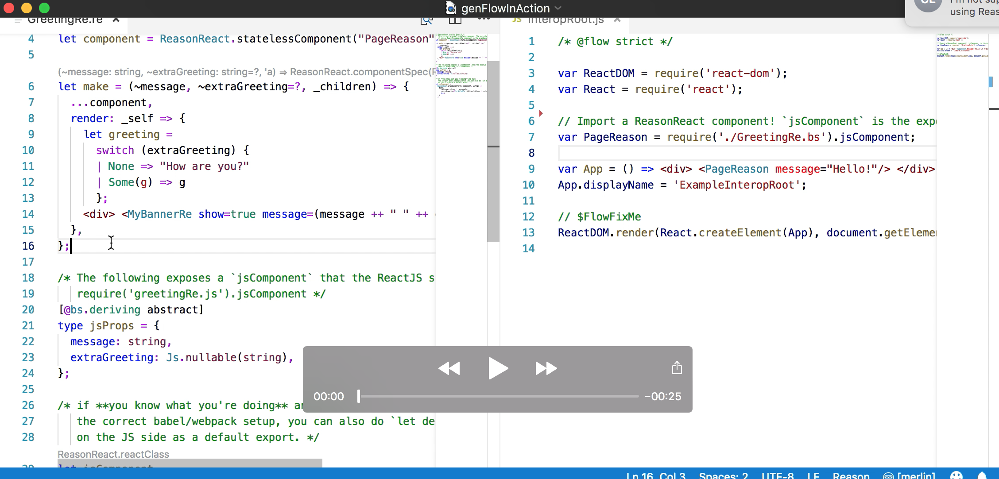
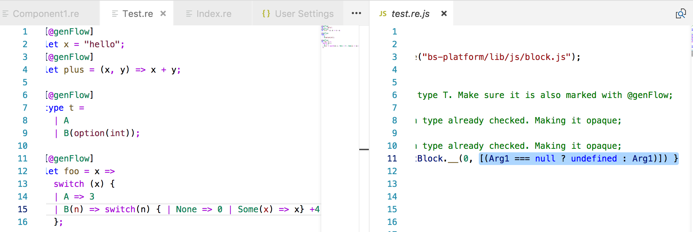
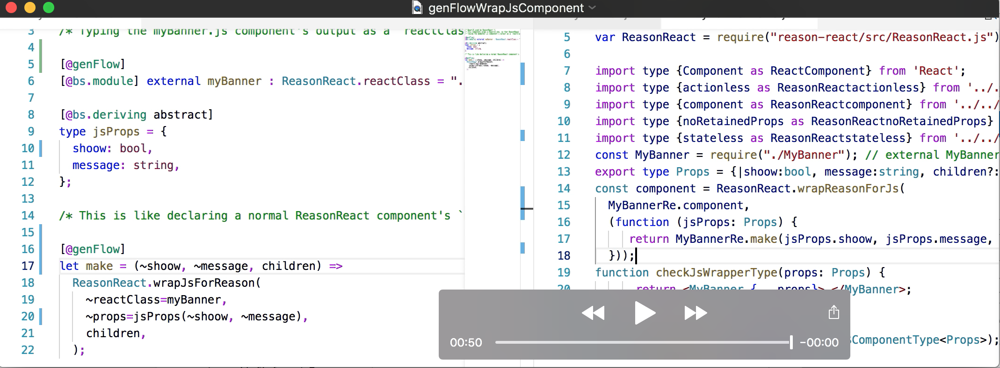

# Reason genFlow / genTypeScript 0.8.0

> **Disclosure:** This project started out as an experiment for better Flow integration, but it's actually also working with TypeScript. This tool will be renamed accordingly in the future.

`genFlow` is a tool to automatically generate typed bindings between [Reason](https://reasonml.github.io/), and either [Flow](https://flow.org/en/) or [TypeScript](https://www.typescriptlang.org/): see the companion project [genTypeScript](https://github.com/cristianoc/genTypeScript) for more info.

`genFlow` generates typed JS wrappers for [ReasonReact](https://reasonml.github.io/reason-react/) components, and in the other direction, if you have ReasonReact wrappers for JS components, it checks that they are well typed.

### Work in progress, only for early adopters. It is possible that the workflow will change in future.

Typed wrappers for using ReasonReact components from javascript are generated when the annotation `[@genType] let make ...` is added to the component definition.

[Here is a video illustrating the conversion of a ReasonReact component.](https://youtu.be/k9QYjq0c8rA)
[](https://youtu.be/k9QYjq0c8rA)


When a `[@genType]` annotation is added to some declaration in e.g. `Module.re`, a file with typed bindings is generated (`Module.re.js` for Flow, `Module.tsx` for TypeScript). The annotation can be added to both value and type declarations.

[Here is a video showing the generation of .re.js files.](https://youtu.be/0YLXGBiB9dY)
[](https://youtu.be/0YLXGBiB9dY)

When a `[@genType]` annotation is added to an external `ReasonReact.reactclass` binding and to the `make` function that calls `ReasonReact.wrapJsForReason` with it, a function `checkJsWrapperType` is generated to catch type errors in wrapping the JS component.

[Here is a video showing how to safely wrap JS components for use from Reason.](https://youtu.be/UKACByHmuQE)
[](https://youtu.be/UKACByHmuQE)

# Download genFlow from Prebuilt Releases

```
# Will download and automatically untar the file in the current directory as genflow.native

# MacOS
curl -L https://github.com/cristianoc/genFlow/releases/download/v0.8.0/genflow-macos.tar.gz | tar xz

# Linux
curl -L https://github.com/cristianoc/genFlow/releases/download/v0.8.0/genflow-linux.tar.gz | tar xz
```

# Quick Start: Set up genFlow in existing TS / Flow / BuckleScript project

There are some steps to set up `genFlow` in a project.
Some of this might become simpler if `genFlow` gets integrated
into bucklescript in future. The current requirement is `bs-platform 4.0.3` or later.

0. Build the genflow binary (`$GENFLOW_REPO/lib/bs/native/genflow.native`) or retrieve it from our prebuilt releases
1. Set environment variable with `export BS_CMT_POST_PROCESS_CMD="$GENFLOW_REPO/lib/bs/native/genflow.native`, before building a project, or starting a watcher / vscode with bsb integration.
2. Add a file [`genflowconfig.json`](examples/reason-react-example/genflowconfig.json) in the project root, and relevant `.shims.js` files in a directory which is visible by bucklescript e.g. [`src/shims/`](examples/reason-react-example/src/shims). An example for a ReasonReact->React shim can be found [here](examples/reason-react-example/src/shims/ReactShim.shim.js).
3. Open your relevant `*.re` file and add `[@genType]` annotations to any bindings / values / functions to be used from javascript. If an annotated value uses a type, the type must be annotated too. See e.g. [Component1.re](examples/reason-react-example/src/basics/Component1.re).
4. If using webpack and Flow, set up [extension-replace-loader](https://www.npmjs.com/package/extension-replace-loader) so webpack will pick up the appropriate `Foo.re.js` instead of `Foo.re`  [example webpack.config.js](examples/reason-react-example/webpack.config.js).

# genFlow Configuration


Every genFlow powered project requires a configuration file in the root of the project, called `genflowconfig.json`. The file has following structure:

```ts
{
  "language" : "flow" | "typescript",
  "shims": [
    "ReasonReact=ReactShim"
  ]
}
```

- **language**
  - "typescript" : Generate `*.tsx` files with TypeScript types
  - "flow": Generate `*.re.js` files with Flow types
  - "untyped": Generate untyped `*.re.js` files. Useful if you are interested in the generated wrappers, but not the types.

- **shims**
  - `Array<string>` with following format: `"ReasonModule=JavaScriptModule"`
  - Required to map certain basic TypeScript/ Flow data types & wrapping logic for Reason data types (e.g. mapping TypeScript lists to Reason lists)

# Supported Types

The following types are currently supported (Reason -> JS Type System):

1. Base types `int` and `string`.
2. Variant types e.g. `type t = | A | B(int)`.
3. Option types e.g. `option(string)`, with automatic conversion to/from `string?`.
4. Array types, with automatic conversion of the values if required.
5. Record types, with automatic conversion to/from javascript objects.


# Limitations

* **BuckleScript in-source = true**. Currently only supports bucklescript projects with [in-source generation](https://bucklescript.github.io/docs/en/build-configuration#package-specs) and `.bs.js` file suffix.

* **No nested modules**. Nested modules are not supported, and annotations will be ignored.

* **Limited JS wrappers**. There must be only one `@genType` annotation on one external binding, and the component it binds is passed to `wrapJsForReason` (this is assumed, not checked). Also, `wrapJsForReason` in the `make` function must simply forward the props, without renaming/wrapping or modifying their values (again, this is assumed, not checked). See for example [MyBannerRe.re](examples/reason-react-example/src/interop/MyBannerRe.re).

# Development

## Build genFlow

```
npm install
npm run build
```
This will create the binary `lib/bs/native/genflow.native`, which is the executable that BuckleScript is supposed to use via `BS_CMT_POST_PROCESS_CMD`.


## Examples

We prepared some examples to give you an idea on how to integrate `genFlow` in your own project. Check out the README of the listed projects.

**Please make sure to build genFlow before trying to build the examples.**

- [reason-react-example](examples/reason-react-example/README.md)
- [typescript-react-example](examples/typescript-react-example/README.md)
- [untyped-react-example](examples/untyped-react-example/README.md)


## Build Linux Build Artifacts (via Docker)

```
# Copies package.json etc. and npm installs the compiler inside the image (workdir: /genFlow)
docker build -t genflow .

# Mounts only the src / lib volume and runs `npm run build`
docker run -it -v $PWD/lib:/genFlow/lib -v $PWD/src:/genFlow/src genflow bash -c "npm run clean && npm run build"
```


## Release Procedure for native binaries (Linux / MacOS)

For now, we do the manual procedure:

```
# MacOS
npm run clean && npm run build
tar -zcvf lib/genflow-macos.tar.gz  -C lib/bs/native genflow.native
```

```
# Linux
docker run -it -v $PWD/lib:/genFlow/lib -v $PWD/src:/genFlow/src genflow bash -c "npm run clean && npm run build"
tar -zcvf lib/genflow-linux.tar.gz  -C lib/bs/native genflow.native
```
