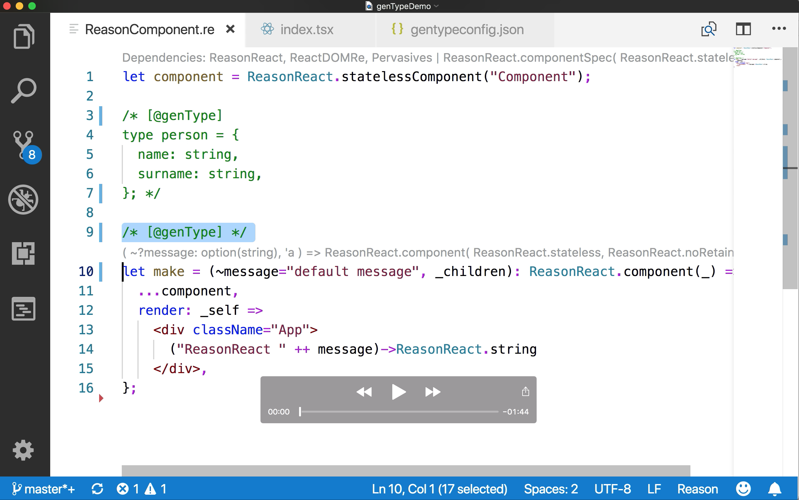

# Reason genType 0.16.0

> **Disclosure:** This project used to be called `genFlow` but has been renamed to `genType`. To migrate from an earlier version, change the path to use `gentype.native`, and the config file to be `gentypeconfig.json`.

`genType` lets you to use [Reason](https://reasonml.github.io/) values from JavaScript idiomatically. In particular, [ReasonReact](https://reasonml.github.io/reason-react/) components. Also, if you're using JavaScript components from Reason, it can check their type.

This article describes how to use `genType` as part of a migration strategy: [Adopting Reason: strategies, dual sources of truth, and why genType is a big deal](https://medium.com/p/c514265b466d).

The implementation performs a type-directed transformation of Reason programs after [bucklescript](https://github.com/BuckleScript/bucklescript) compilation. The transformed programs operate on data types idiomatic to JS. For example, a Reason function operating on a Reason record `{x:3}` (which is represented as `[3]` at runtime) is mapped to a JS function operating on the corresponding JS object `{x:3}`.

There are 3 back-ends, to choose if generated JS code is untyped, or typed with either [TypeScript](https://www.typescriptlang.org/) or [Flow](https://flow.org/en/).
If a typed back-end is used, `genType` generates typed JS wrappers. In the other direction, if you have ReasonReact wrappers for JS components, it generates code to check that they are well typed.


### Work in progress, only for early adopters. It is possible that the workflow will change in future.

-----

Wrappers for using ReasonReact components from JavaScript are generated when the annotation `[@genType] let make ...` is added to the component definition.

[Here is a video illustrating the conversion of a ReasonReact component.](https://youtu.be/EV12EbxCPjM)
[](https://youtu.be/EV12EbxCPjM)


# Download genType from Prebuilt Releases

```
# Will download and automatically untar the file in the current directory as gentype.native

# MacOS
curl -L https://github.com/cristianoc/genType/releases/download/v0.16.0/gentype-macos.tar.gz | tar xz

# Linux
curl -L https://github.com/cristianoc/genType/releases/download/v0.16.0/gentype-linux.tar.gz | tar xz
```

# Quick Start: Set up genType in existing TypeScript / Flow / BuckleScript project

There are some steps to set up `genType` in a project.
Some of this might become simpler if `genType` gets integrated
into bucklescript in future. The current requirement is `bs-platform 4.0.5` or later.

0. Build the gentype.native binary (`$GENTYPE_REPO/lib/bs/native/gentype.native`) or retrieve it from our prebuilt releases
1. Set environment variable with `export BS_CMT_POST_PROCESS_CMD="$GENTYPE_REPO/lib/bs/native/gentype.native`, before building a project, or starting a watcher / vscode with bsb integration.
2. Add a file [`gentypeconfig.json`](examples/reason-react-example/gentypeconfig.json) in the project root, and relevant `.shims.js` files in a directory which is visible by bucklescript e.g. [`src/shims/`](examples/reason-react-example/src/shims). An example for a ReasonReact->React shim can be found [here](examples/reason-react-example/src/shims/ReactShim.shim.js).
3. Open your relevant `*.re` file and add `[@genType]` annotations to any bindings / values / functions to be used from JavaScript. If an annotated value uses a type, the type must be annotated too. See e.g. [Component1.re](examples/reason-react-example/src/basics/Component1.re).
4. If using webpack and Flow, set up [extension-replace-loader](https://www.npmjs.com/package/extension-replace-loader) so webpack will pick up the appropriate `Foo.re.js` instead of `Foo.re`  [example webpack.config.js](examples/reason-react-example/webpack.config.js).

# genType Configuration


Every genType powered project requires a configuration file in the root of the project, called `gentypeconfig.json`. The file has following structure:

```ts
{
  "language" : "typescript" | "flow" | "untyped",
  "shims": {
    "ReasonReact": "ReactShim"
  }
}
```

- **language**
  - "typescript" : Generate `*.tsx` files with TypeScript types.
  - "flow": Generate `*.re.js` files with Flow types.
  - "untyped": Generate `*.re.js` files with no type annotations.

- **shims**
  - `Array<string>` with following format: `"ReasonModule=JavaScriptModule"`
  - Required to map certain basic TypeScript/ Flow data types & wrapping logic for Reason data types (e.g. mapping TypeScript lists to Reason lists)

# Types Supported

### int
Reason values e.g. `1`, `2`, `3` are unchanged. So they are mapped to JS values of type `number`.

### float
Reason values e.g. `1.0`, `2.0`, `3.0` are unchanged. So they are mapped to JS values of type `number`.

### string
Reason values e.g. `"a"`, `"b"`, `"c"` are unchanged. So they are mapped to JS values of type `string`.

### optionals
Reason values of type e.g. `option(int)`, such as `None`, `Some(0)`, `Some(1)`, `Some(2)`, are mapped to JS values `null`, `undefined`,  `0`, `1`, `2`.
The JS values are unboxed, and `null`/`undefined` are conflated.
So they are mapped to JS values of type `null` or `undefined` or `number`.

### nullables
Reason values of type e.g. `Js.Nullable.t(int)`, such as `Js.Nullable.null`, `Js.Nullable.undefined`, `Js.Nullable.return(0)`, `Js.Nullable.return(1)`, `Js.Nullable.return(2)`, are mapped to JS values `null`, `undefined`,  `0`, `1`, `2`.
The JS values are identical: there is no conversion unless the argument type needs conversion.

### records
Reason record values of type e.g. `{x:int}` such as `{x:0}`, `{x:1}`, `{x:2}`, are mapped to JS object values `{x:0}`, `{x:1}`, `{x:2}`. This requires a change of runtime representation from arrays to objects.
So they are mapped to JS values of type `{x:number}`.

The `@genType.as` annotation can be used to change the name of a field on the JS side of things. So e.g. `{[@genType.as "y"] x:int}` is mapped to the JS type `{y:int}`.

If one field of the Reason record has option type, this is represented as an optional JS field. So for example Reason type `{x: option(int)}` corresponds to the JS type `{x?: number}`.

### objects
Reason object values of type e.g. `{. "x":int}` such as `{"x": 0}`, `{"x": 1}`, `{"x": 2}`, are mapped to identical JS object values `{x:0}`, `{x:1}`, `{x:2}`. This requires no conversion. So they are mapped to JS values of type `{x:number}`.
A conversion is required only when the type of some field requires conversions.

It is possible to mix object and option types, so for example the Reason type `{. "x":int, "y":option(string)}` corresponds to JS type `{x:number, ?y: string}`, requires no conversion, and allows option pattern matching on the Reason side.

### variants
Reason values of variant type e.g. `| A | B(int)` have the same representation in JS. Constructor functions with the same name as the variants are generated, so e.g. `A` and `B(3)` are valid JS programs to generate Reason values.


### arrays
Arrays with elements of Reason type `t` are mapped to JS arrays with elements of the corresponding JS type. If a conversion is required, a copy of the array is performed.

### functions
Reason functions are represented as JS functions of the corresponding type.
So for example a Reason function `foo : int => int` is represented as a JS function from numbers to numbers.

If named arguments are present in the Reason type, they are grouped and represented as JS objects. For example `foo : (~x:int, ~y:int) => int` is represented as a JS function from objects of type `{x:number, y:number}` to numbers.

In case of mixed named and unnamed arguments, consecutive named arguments form separate groups. So e.g. `foo : (int, ~x:int, ~y:int, int, ~z:int) => int` is mapped to a JS function of type `(number, {x:number, y:number}, number, {z:number}) => number`.


### components
ReasonReact components with props of Reason types `t1`, `t2`, `t3` are mapped to reactjs components with props of the JS types corresponding to `t1`, `t2`, `t3`.

### polymorphic types
If a Reason type contains a type variable, the corresponding value is not converted. In other words, the conversion is the identity function. For example, a Reason function of type `{payload: 'a} => 'a` must treat the value of the payload as a black box, as a consequence of parametric polymorphism. If a typed back-end is used, the reason type is mapped to the corresponding generic type.


# Limitations

* **BuckleScript in-source = true**. Currently only supports bucklescript projects with [in-source generation](https://bucklescript.github.io/docs/en/build-configuration#package-specs) and `.bs.js` file suffix.

* **No nested modules**. Nested modules are not supported, and annotations will be ignored.

* **Limited JS wrappers**. There must be only one `@genType` annotation on one external binding, and the component it binds is passed to `wrapJsForReason` (this is assumed, not checked). Also, `wrapJsForReason` in the `make` function must simply forward the props, without renaming/wrapping or modifying their values (again, this is assumed, not checked). See for example [MyBannerRe.re](examples/reason-react-example/src/interop/MyBannerRe.re).

# Development

## Build genType

```
npm install
npm run build
```
This will create the binary `lib/bs/native/gentype.native`, which is the executable that BuckleScript is supposed to use via `BS_CMT_POST_PROCESS_CMD`.


## Examples

We prepared some examples to give you an idea on how to integrate `genType` in your own project. Check out the README of the listed projects.

**Please make sure to build genType before trying to build the examples.**

- [reason-react-example](examples/reason-react-example/README.md)
- [typescript-react-example](examples/typescript-react-example/README.md)
- [untyped-react-example](examples/untyped-react-example/README.md)


## Release Procedure for MacOS and Linux binaries

For now, this is a manual process to create `lib/gentype-macos.tar.gz` and  `lib/gentype-linux.tar.gz` on a Mac. The linux binaries are created using a docker container.


```
./create-release.sh
```
